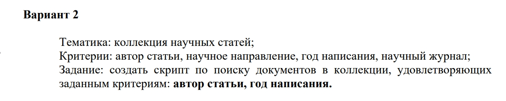

# Операционные системы 4 семестр

## Lab1 Linux вариант 3

## Lab1 Windows вариант 3

## Lab2 Linux

1. Отобразить информацию о трех заданных процессах в реальном режиме, одному из процессов переназначить приоритет, не выходя из команды.

2. Послать сигнал на безусловное завершение (по имени и по номеру сигнала) процессу по его имени, установить подтверждение завершения.

3. Выведите статистику работы системы с момента последней загрузки.

## Lab3 Linux вариант 2

## Lab4 Linux вариант 3

## Lab5 Linux-Linux

Гайд как делать в папке

## Lab6

Только таск, потому что лабу в Github не запихнешь:)
